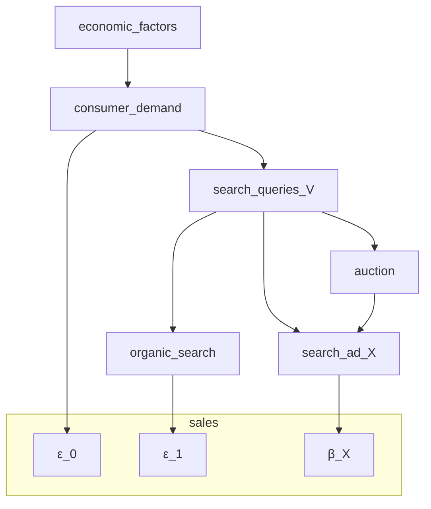
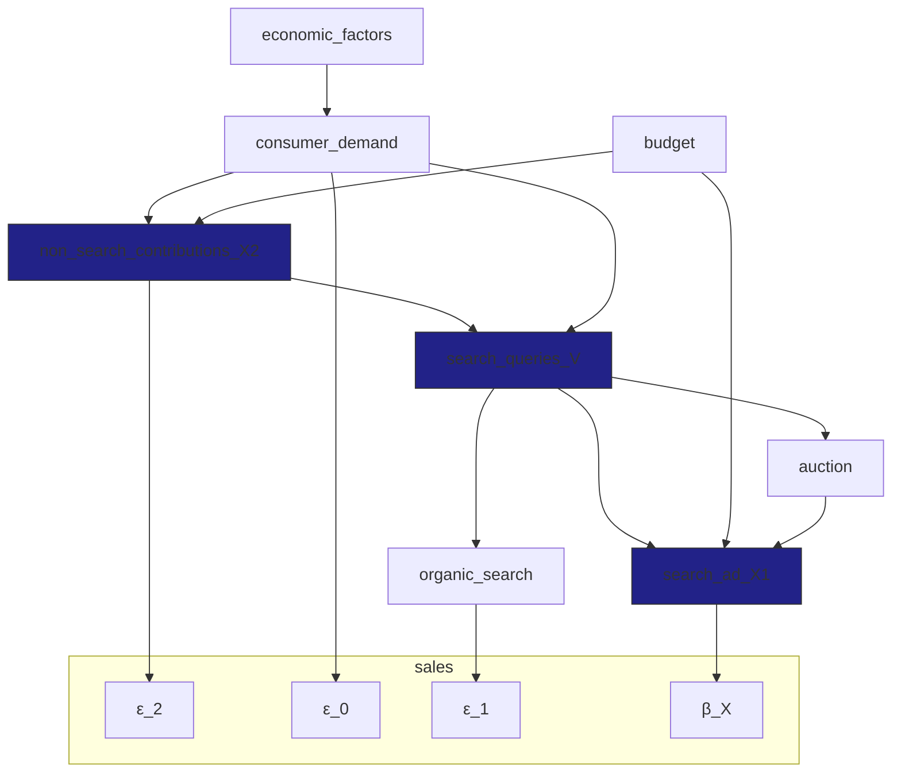

# 論文: Bias Correction For Paid Search In Media Mix Modeling
[arXiv](https://arxiv.org/abs/1807.03292)

## 概要
- 2018年、Google
- MMMにおける検索広告のターゲティングによる選択バイアスの補正手法を提案
- バックドア基準に基づき、DAGを用いたアプローチ

## 内容

### 1. Introduction and problem description
- 既存のMMMの課題: 選択バイアス
  - 効果が高いと推定されるユーザーに広告が集中するため、効果が過大評価されやすい
- 本手法の目的
  - 検索広告の選択バイアスを補正する手法を提案

### 2. Related work
- 省略

### 3. Preliminary to Pearl’s causal theory
- DAGやバックドア基準に関する解説
- 省略

### 4. Metholody

#### 4.1 Simple scenario
- シナリオ
  - 検索広告が唯一の広告チャンネルである
  - 他のチャンネルの貢献が無視できる
- モデル定義
  - $Y_{t} = \beta_{0} + \beta_{1} X_{t} + \varepsilon_{t}$
    - Y: 売上
    - X: 検索広告コスト
    - β0: 切片
    - β1: ROAS
    - ε: 誤差項
  - ※以降tは省略
- 課題
  - Xとεが相関している可能性がある
    - 内生性問題が生じており、OLS推定量が不偏性を満たさない
- アプローチの整理
  - 下記のようにモデルを書き換えることで、OLS推定量が不偏性を満たすようにする
  - モデルの書き換え 
    - $Y = \beta_{0} + ( \beta_{1} + \gamma)X + \eta$
  - 前提
    - $\varepsilon = \gamma X + \eta$
    - $\gamma = cov(X,\varepsilon)/var(X)$
    - $\eta = \varepsilon - \gamma X$
- εの整理
  - ε0: 消費者需要による直接的な影響
  - ε1: オーガニック検索結果による影響
- 検索クエリ数Vによるコントロール
  - $\varepsilon_{0} \perp X | V$
    - 検索クエリを条件として、検索広告コストはオーガニック検索影響とは独立
  - $\varepsilon_{1} \perp X | V$
    - 下記仮定に基づき、下記DAGが記載でき、上記であることが確認できる
- 仮定
  - 広告主の検索広告予算に制限がない
  - 検索クエリ量で条件づけるｋとおで、消費者需要や入札や他社の行動などの要因は無視できる
- DAG

- 定理1
  - 上記DAGが成り立つ場合、下記式を用いて一致性を持って推定できる
  - $Y = \beta_{0} + \beta_{1} X + f(V) + \eta$ 
- 注意
  - DAGが成立するか要確認
    - 例: 天候から大きな影響を受けるビジネスの場合は、DAGが成立しない可能性がある

#### 4.2 Complex scenario
- シナリオ
  - 検索広告以外の広告チャンネルが存在する
    - それらは検索量を増加させる可能性がある
- DAG

- 定理2
  - 上記DAGが成り立つ場合、下記式を用いて一致性を持って推定できる
  - $Y = \beta_{0} + \beta_{1} X_{1} + f(V,X_{2}) + \eta$
    - f(v,x2): $E(\varepsilon_{0} | V = v, X_{2} = x2) + E(\varepsilon_{1} | V = v) + E(\varepsilon_{2} | X_{2} = x2)$
    - ηは残差項で、X1とf(V,X2)とは相関していない
- シナリオ2
  - 検索広告コストがほかのメディアコストと直接相関しないケース
  - 省略

#### 4.3 Estimation of full MMM
- 実際のMMMに適用する際の注意
  - $Y = \beta_{0} + \beta_{1} X_{1} + f(V,X_{2}) + \eta$
  - この論文では主に検索広告(X1)の影響推定に焦点を当てている
  - 実務では非検索広告(X2)の影響も考慮する必要があるが、一致性を満たすことが難しい課題がある
- アイデア
  - 実務で行う際は、バイアス補正方法を用いて検索広告(X1)の効果を推定し、その結果を固定した状態で非検索広告(X2)の効果を推定すると良い

### 5. Implementation
- 実装方法の紹介

#### 5.1 Summarization of search query data
- Step1
  - 自社と競合他社の特定
- Step2
  - 特定の期間・エリアでの全てのクエリを収集する
  - 各URLがオーガニック検索に表示される回数を集計する
  - データ構造
    - $( q_{i}, u_{j}, n_{i,j})$
      - q_i: i番目のクエリ
      - u_j: j番目のURL
      - n_i,j: i番目のクエリでj番目のURLが表示された回数
- Step3
  - クエリの集合$S$を下記4グループに分割する
    - a. 自社
    - b. 競合他社
    - c. 自社でも競合でもないが、同業種
    - d. その他
  - 任意のクエリ$q_{i}$について、impの合計を下記のように表す
    - $w_{i,a}$: aグループのimpの合計
    - $w_{i,total}$: a,b,c,dグループのimpの合計
    - $w_{i,category}$: a,b,cグループのimpの合計
  - クエリ集合$S$
    - $w_{category} / w_{total}$が閾値より高い: カテゴリ寄りと判定
      - $S_{1}$ : $w_{a} / w_{category}$が閾値より高い: 自社寄りと判定
      - $S_{2}$ : w_{b} / w_{category}$が閾値より高い: 競合寄りと判定
      - $S_{3}$ : それ以外: 一般関心と判定
    - $w_{category} / w_{total}$が閾値より低い: 無視
    - ※ここでの閾値は50%が有効であるとわかっている
- Step4
  - 検索ボリューム$V$
    - $V_{n,t}$ : 時間軸tの$S_{n}$クエリセットの検索総数

#### 5.2 Model fitting procedure
- 4.1のシンプルのシナリオの場合
  - 観測数が十分でない場合
    - $f(V)$を加法関数として近似する
    - $Y ~ \beta_{0} + \beta_{1} X + s(V_{1}) + s(V_{2}) + s(V_{3})$ 
      - s(・)はWood(2006)で提案されたスムース関数
  - 観測数が十分多い場合
    - $f(V)$をWood(2006)で提案された3次元の全テンソル積スムースによって近似する
    - $Y ~ \beta_{0} + \beta_{1} X + te(V_{1},V_{2},V_{3})$

### 6. Case studies in simple scenarios
- 検索広告が唯一の広告チャンネルであるシナリオにおいて、提案手法の有効性を検証

#### 6.1 Case 1
- 比較
  - 提案手法と、ナイーブ推定、カテゴリ検索ボリュームによる需要調整を比較した
  - ランダムなエリアABテストの結果と比較した
    - 提案手法が最もエリアテストの結果と近く、別の方法はROASを数倍過大評価していた
- モデル
  - $response ~ \beta_{0} + \beta_{1} adspend + s(target) + s(competitiors) + s(general.interest)$
    - $response$: 売上
    - $adspend$: 検索広告コスト

#### 6.2 Case 2
- 省略

#### 6.3 Case 3
- 省略

#### 6.4 Empirical observations and discussions
- 省略

### 7. Case studies with complex scenario
- 検索広告以外にも出稿している広告主の3年分のデータを用いて検証した
- ナイーブ推定とは違った結果が得られたが、どちらが正しいかに関しては評価はない

### 8. Discussion
- 本論文の貢献と課題を整理
- 省略

## メモ
- 5.2のモデル記述にあったREML、GAM関数、Wood(2006)のスムース関数、REMLアルゴリズム、MGCVライブラリについて調べたい