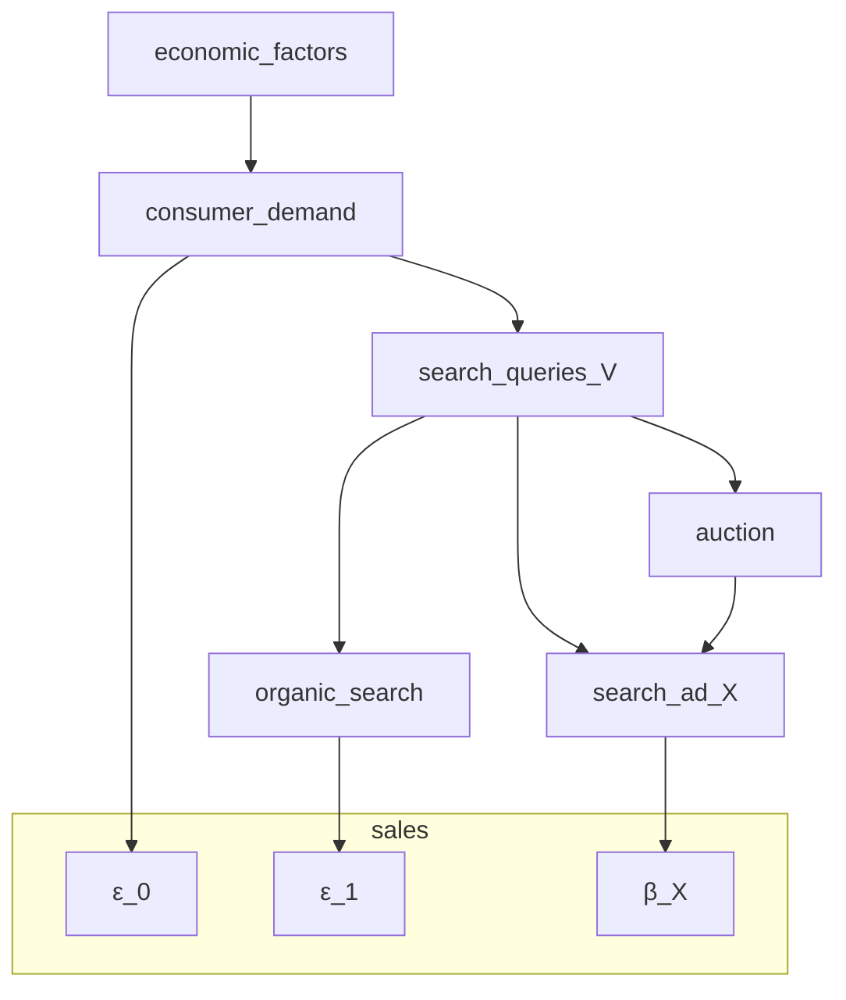

# 論文: Bias Correction For Paid Search In Media Mix Modeling
[arXiv](https://arxiv.org/abs/1807.03292)

## 概要
- 2018年、Google
- MMMにおける検索広告のターゲティングによる選択バイアスの補正手法を提案
- バックドア基準に基づき、DAGを用いたアプローチ

## 内容

### 1. Introduction and problem description
- 既存のMMMの課題: 選択バイアス
  - 効果が高いと推定されるユーザーに広告が集中するため、効果が過大評価されやすい
- 本手法の目的
  - 検索広告の選択バイアスを補正する手法を提案

### 2. Related work
- 省略

### 3. Preliminary to Pearl’s causal theory
- DAGやバックドア基準に関する解説
- 省略

### 4. Metholody

#### 4.1 Simple scenario
- シナリオ
  - 検索広告が唯一の広告チャンネルである
  - 他のチャンネルの貢献が無視できる
- モデル定義
  - $Y_{t} = \beta_{0} + \beta_{1} X_{t} + \varepsilon_{t}$
    - Y: 売上
    - X: 検索広告コスト
    - β0: 切片
    - β1: ROAS
    - ε: 誤差項
  - ※以降tは省略
- 課題
  - Xとεが相関している可能性がある
    - 内生性問題が生じており、OLS推定量が不偏性を満たさない
- アプローチの整理
  - 下記のようにモデルを書き換えることで、OLS推定量が不偏性を満たすようにする
  - モデルの書き換え 
    - $Y = \beta_{0} + ( \beta_{1} + \gamma)X + \eta$
  - 前提
    - $\varepsilon = \gamma X + \eta$
    - $\gamma = cov(X,\varepsilon)/var(X)$
    - $\eta = \varepsilon - \gamma X$
- εの整理
  - ε0: 消費者需要による直接的な影響
  - ε1: オーガニック検索結果による影響
- 検索クエリ数Vによるコントロール
  - $\varepsilon_{0} \perp X | V$
    - 検索クエリを条件として、検索広告コストはオーガニック検索影響とは独立
  - $\varepsilon_{1} \perp X | V$
    - 下記仮定に基づき、下記DAGが記載でき、上記であることが確認できる
- 仮定
  - 広告主の検索広告予算に制限がない
  - 検索クエリ量で条件づけるｋとおで、消費者需要や入札や他社の行動などの要因は無視できる
- DAG

- 定理
  - 上記DAGが成り立つ場合、下記式を用いて一致性を持って推定できる
  - $Y = \beta_{0} + \beta_{1} X + f(V) + \eta$ 
- 注意
  - DAGが成立するか要確認
    - 例: 天候から大きな影響を受けるビジネスの場合は、DAGが成立しない可能性がある
<<<<<<< HEAD

### 4.2 Complex scenario
- シナリオ
  - 検索広告以外の広告チャンネルが存在する
    - それらは検索量を増加させる可能性がある
- DAG
  - 
=======
>>>>>>> bd8645afb255c360a833abb9b9ba82b9754f6729
